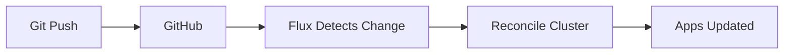

<div align="center">

# 🏠 Homelab Kubernetes

### Production-grade Kubernetes on Proxmox with Talos Linux & GitOps

[](https://www.talos.dev/)
[](https://kubernetes.io/)
[](https://fluxcd.io/)
[](https://www.mend.io/renovate/)

</div>

---

## 📖 Overview

This repository contains Infrastructure as Code for my personal Kubernetes homelab cluster. The cluster runs on [Talos Linux](https://www.talos.dev/) - an immutable, secure OS built specifically for Kubernetes - deployed on Proxmox VE virtual machines.

All cluster configuration is managed declaratively through [Flux](https://fluxcd.io/) GitOps, with secrets encrypted using [SOPS](https://github.com/getsops/sops) and [Age](https://github.com/FiloSottile/age).

## 🖥️ Hardware

The cluster runs on a 3-node Proxmox VE cluster with Ceph storage:

| Node | CPU | RAM | Storage | Role |
|:-----|:----|:----|:--------|:-----|
| pve1 | Intel i5 | 64GB | 2TB NVMe | Proxmox + Ceph |
| pve2 | Intel i5 | 64GB | 2TB NVMe | Proxmox + Ceph |
| pve3 | Intel i5 | 64GB | 2TB NVMe | Proxmox + Ceph |

## 🌐 Cluster

<table>
<tr><th>Nodes</th><th>Network</th></tr>
<tr><td>

| Name | Role | IP |
|:-----|:-----|:---|
| talos-cp-1 | Control Plane | `172.16.1.50` |
| talos-cp-2 | Control Plane | `172.16.1.51` |
| talos-cp-3 | Control Plane | `172.16.1.52` |
| talos-worker-1 | Worker | `172.16.1.53` |

</td><td>

| Service | IP |
|:--------|:---|
| Cluster VIP | `172.16.1.49` |
| DNS Gateway | `172.16.1.60` |
| Internal Ingress | `172.16.1.61` |
| External Ingress | `172.16.1.62` |

</td></tr>
</table>

## ⚙️ Core Components

<table>
<tr><td width="50%">

### 🔧 Infrastructure
| Component | Purpose |
|:----------|:--------|
| [Cilium](https://cilium.io/) | CNI & Load Balancer |
| [CoreDNS](https://coredns.io/) | Cluster DNS |
| [Spegel](https://github.com/spegel-org/spegel) | P2P Image Registry |
| [Reloader](https://github.com/stakater/Reloader) | Secret Reloading |

</td><td>

### 🔐 Security & Networking
| Component | Purpose |
|:----------|:--------|
| [cert-manager](https://cert-manager.io/) | TLS Certificates |
| [Envoy Gateway](https://gateway.envoyproxy.io/) | Ingress Controller |
| [k8s-gateway](https://github.com/ori-edge/k8s_gateway) | Split-horizon DNS |
| [SOPS](https://github.com/getsops/sops) | Secret Encryption |

</td></tr>
</table>

## 📦 Applications

| App | URL | Description |
|:----|:----|:------------|
| 🏠 **Homepage** | [home.ragas.cc](https://home.ragas.cc) | Dashboard with service widgets |
| 📊 **Grafana** | [grafana.ragas.cc](https://grafana.ragas.cc) | Monitoring dashboards |
| 📈 **Prometheus** | [prometheus.ragas.cc](https://prometheus.ragas.cc) | Metrics & alerting |
| 🔔 **Alertmanager** | [alertmanager.ragas.cc](https://alertmanager.ragas.cc) | Alert management |
| 📚 **Docs** | [docs.ragas.cc](https://docs.ragas.cc) | Documentation site |

## 📂 Repository Structure

```
📁 kubernetes/
├── 📁 apps/                 # Application deployments
│   ├── 📁 cert-manager/     # TLS certificates
│   ├── 📁 default/          # User applications
│   ├── 📁 flux-system/      # GitOps operator
│   ├── 📁 kube-system/      # Core services
│   ├── 📁 monitoring/       # Prometheus stack
│   └── 📁 network/          # Ingress & DNS
├── 📁 bootstrap/            # Initial cluster setup
│   ├── 📄 helmfile.yaml     # Bootstrap apps
│   └── 📁 talos/            # Talos machine configs
├── 📁 components/           # Reusable Kustomize components
└── 📁 flux/                 # Flux configuration
📁 docs/                     # MkDocs documentation
📁 talos/                    # Generated Talos configs
```

## 🚀 Quick Start

<details>
<summary>Prerequisites</summary>

Install tools via [mise](https://mise.jdx.dev/):

```bash
mise trust && mise install
```

Or install manually:
- `kubectl` - Kubernetes CLI
- `flux` - Flux CLI  
- `talosctl` - Talos CLI
- `sops` - Secret encryption
- `age` - Encryption tool

</details>

<details>
<summary>Access Cluster</summary>

```bash
export KUBECONFIG=/path/to/kubeconfig

# Verify access
kubectl get nodes
```

</details>

<details>
<summary>Common Commands</summary>

```bash
# Flux status
flux get ks -A
flux get hr -A

# Force sync
flux reconcile ks cluster-apps --with-source

# Cilium status  
cilium status

# Decrypt secret
sops -d kubernetes/apps/cert-manager/cert-manager/app/secret.sops.yaml
```

</details>

## 🔄 GitOps Workflow



1. **Edit** manifests in `kubernetes/apps/`
2. **Commit** and push to GitHub
3. **Flux** automatically reconciles the cluster

## 📚 Documentation

Full documentation is available in the [`docs/`](docs/) directory:

| Section | Description |
|:--------|:------------|
| [Architecture](docs/architecture/) | Cluster design, networking, storage, security |
| [Services](docs/services/) | Application-specific documentation |
| [Guides](docs/guides/) | How-to guides for common tasks |
| [Runbooks](docs/runbooks/) | Operational procedures |

## 🙏 Acknowledgments

This cluster is built on the excellent work of:

- [onedr0p/cluster-template](https://github.com/onedr0p/cluster-template) - GitOps template
- [Talos Linux](https://www.talos.dev/) - Secure Kubernetes OS
- [Flux](https://fluxcd.io/) - GitOps toolkit

---

<div align="center">

**[Documentation](https://docs.ragas.cc)** · **[Architecture](docs/architecture/)** · **[Guides](docs/guides/)**

</div>
