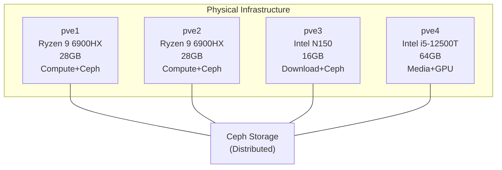
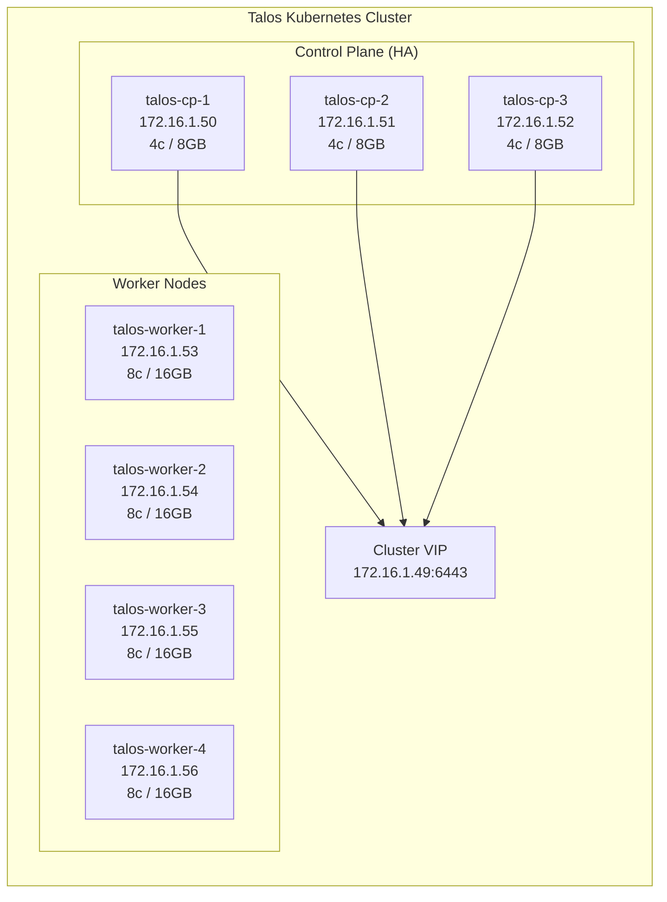
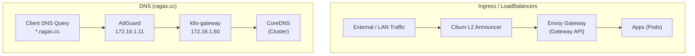
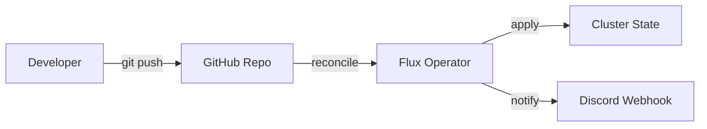
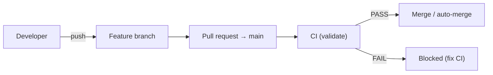
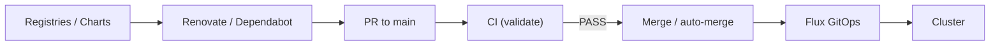
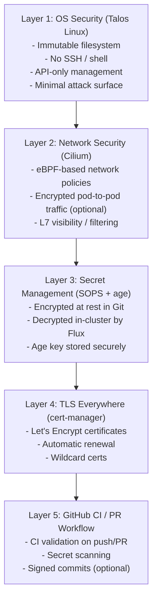

<div align="center">

# 🏠 Homelab Kubernetes

### Production-grade Kubernetes on Proxmox with Talos Linux & GitOps

[](https://www.talos.dev/)
[](https://kubernetes.io/)
[](https://fluxcd.io/)

</div>

---

## Table of Contents

- [Overview](#overview)
- [Architecture](#architecture)
  - [Infrastructure Layer](#infrastructure-layer)
  - [Kubernetes Cluster](#kubernetes-cluster)
  - [Networking](#networking)
  - [Storage](#storage)
- [GitOps & CI/CD](#gitops--cicd)
  - [Flux GitOps](#flux-gitops)
  - [Branch Protection](#branch-protection)
  - [Automated Testing](#automated-testing)
  - [Image Automation](#image-automation)
- [Security](#security)
- [Applications](#applications)
- [Repository Structure](#repository-structure)
- [Documentation](#documentation)

---

## Overview

This repository contains the complete Infrastructure as Code for a production-grade Kubernetes homelab. Every component is declaratively defined, version controlled, and automatically deployed via GitOps.

### Design Principles

- **Immutable Infrastructure** - Talos Linux provides an immutable, API-driven OS
- **GitOps Everything** - All changes flow through Git with full audit trail
- **Defense in Depth** - Multiple layers of security from OS to application
- **High Availability** - 3 control plane nodes with automated failover
- **Automated Operations** - Self-healing, auto-updates, auto-scaling

---

## Architecture

### Infrastructure Layer

The cluster runs on a 4-node Proxmox VE hypervisor cluster with Ceph distributed storage:



### Kubernetes Cluster

7 Talos Linux VMs (3 control plane + 4 workers) form the Kubernetes cluster:



### Networking

Cilium provides advanced networking with eBPF:



**LoadBalancer IPs:**

- `172.16.1.60` k8s-gateway (DNS)
- `172.16.1.61` envoy-internal (HTTPS)
- `172.16.1.62` envoy-external (HTTPS)

### Storage

Storage is provided by Proxmox Ceph (via Ceph CSI) plus NFS for backups/media:

| Type | Provider | Use Case |
|------|----------|----------|
| etcd | Local NVMe | Kubernetes state |
| Ephemeral | EmptyDir | Temporary data |
| Persistent (RWO) | Ceph RBD (`ceph-block`) | Databases / metrics |
| Persistent (RWX) | CephFS (`ceph-filesystem`) | App config / shared storage |
| Backups / Media | NFS (NAS) | Large, read-heavy or backup data |

---

## GitOps & CI/CD

### Flux GitOps

All cluster state is managed through Flux GitOps:



**Components:**
- **Source Controller** - Watches Git repositories
- **Kustomize Controller** - Applies Kustomizations
- **Helm Controller** - Manages HelmReleases
- **Notification Controller** - Sends alerts to Discord
- **(Optional) Image Automation** - Manifests exist but are currently disabled; updates handled via Renovate/Dependabot

### Branch Protection

GitHub branch protection is enabled for `main`: changes merge via PRs, and the Validate checks must pass.



### Automated Testing

Every PR runs through comprehensive CI:

| Check | Tool | Purpose |
|-------|------|---------|
| **YAML Lint** | yamllint | Syntax and style validation |
| **Kubeconform** | kubeconform | Kubernetes schema validation |
| **Flux Local** | flux-local | Offline Flux validation |
| **Security Scan** | Trivy | Vulnerability detection |
| **Secret Scan** | Gitleaks | Credential leak prevention |

### Image Automation

Dependency and image tag updates are handled via Renovate/Dependabot. (Optional) Flux Image Automation manifests exist but are currently disabled.



---

## Security

### Layers of Security



---

## Applications

### Deployed Services

| Category | Service | URL | Description |
|----------|---------|-----|-------------|
| **Dashboard** | Homepage | [home.ragas.cc](https://home.ragas.cc) | Service dashboard with widgets |
| **Monitoring** | Grafana | [grafana.ragas.cc](https://grafana.ragas.cc) | Metrics visualization |
| **Monitoring** | Prometheus | [prometheus.ragas.cc](https://prometheus.ragas.cc) | Metrics collection |
| **Monitoring** | Alertmanager | [alertmanager.ragas.cc](https://alertmanager.ragas.cc) | Alert routing |
| **Docs** | MkDocs | [docs.ragas.cc](https://docs.ragas.cc) | This documentation |

### Core Infrastructure

| Component | Version | Purpose |
|-----------|---------|---------|
| Cilium | 1.18.4 | CNI, LoadBalancer, Network Policies |
| CoreDNS | 1.45.0 | Cluster DNS |
| cert-manager | 1.19.1 | TLS certificate management |
| Envoy Gateway | 1.6.1 | Gateway API ingress |
| Flux | 0.36.0 | GitOps operator |
| kube-prometheus-stack | 72.6.2 | Full monitoring stack |

---

## Repository Structure

```
k3s-homelab/
├── .github/
│   ├── workflows/           # GitHub Actions
│   │   ├── validate.yaml    # CI: lint, validate, test
│   │   ├── auto-merge.yaml  # Auto-merge Dependabot PRs
│   │   ├── flux-image-pr.yaml # Create PRs for image updates
│   │   ├── flux-diff.yaml   # Show Flux changes on PRs
│   │   ├── security.yaml    # Trivy + Gitleaks scanning
│   │   ├── labeler.yaml     # Auto-label PRs
│   │   └── release-drafter.yaml # Generate release notes
│   ├── dependabot.yaml      # Dependabot config
│   └── labeler.yaml         # Label rules
├── .githooks/
│   └── pre-push             # Local validation hook
├── kubernetes/
│   ├── apps/                # Application deployments
│   │   ├── cert-manager/    # TLS certificates
│   │   ├── default/         # User applications
│   │   │   ├── homepage/    # Dashboard
│   │   │   ├── mkdocs/      # Documentation
│   │   │   └── echo/        # Test app
│   │   ├── flux-system/     # GitOps components
│   │   │   ├── flux-operator/
│   │   │   ├── flux-instance/
│   │   │   ├── notifications/  # Discord alerts
│   │   │   └── image-automation/ # Auto-update images
│   │   ├── kube-system/     # Core services
│   │   │   ├── cilium/      # CNI
│   │   │   ├── coredns/     # DNS
│   │   │   ├── metrics-server/
│   │   │   ├── reloader/
│   │   │   └── spegel/      # Image cache
│   │   ├── monitoring/      # Observability
│   │   │   └── kube-prometheus-stack/
│   │   └── network/         # Ingress & DNS
│   │       ├── envoy-gateway/
│   │       └── k8s-gateway/
│   ├── components/          # Shared Kustomize components
│   │   └── sops/            # SOPS decryption
│   └── flux/                # Flux bootstrap
│       └── cluster/
├── talos/                   # Talos machine configs
│   ├── talconfig.yaml       # Cluster definition
│   ├── talsecret.sops.yaml  # Encrypted secrets
│   └── clusterconfig/       # Generated configs
├── docs/                    # MkDocs documentation
│   ├── architecture/
│   ├── services/
│   ├── guides/
│   └── runbooks/
├── scripts/
│   └── setup-hooks.sh       # Git hooks setup
├── .pre-commit-config.yaml  # Pre-commit hooks
├── .yamllint.yaml           # YAML linting rules
├── .sops.yaml               # SOPS encryption config
└── mkdocs.yml               # Documentation config
```

---

## Documentation

Comprehensive documentation is available at [docs.ragas.cc](https://docs.ragas.cc):

| Section | Description |
|---------|-------------|
| **[Architecture](docs/architecture/)** | System design, networking, storage, security, CI/CD |
| **[Services](docs/services/)** | Configuration guides for each deployed service |
| **[Guides](docs/guides/)** | How-to guides for common operations |
| **[Runbooks](docs/runbooks/)** | Incident response procedures |

---

## Acknowledgments

This project builds on the work of:

- [onedr0p/cluster-template](https://github.com/onedr0p/cluster-template) - GitOps patterns
- [Talos Linux](https://www.talos.dev/) - Secure Kubernetes OS
- [Flux](https://fluxcd.io/) - GitOps toolkit
- [Cilium](https://cilium.io/) - eBPF networking

---

<div align="center">

**[Documentation](https://docs.ragas.cc)** · **[GitHub](https://github.com/sagaragas/k3s-homelab)**

</div>
