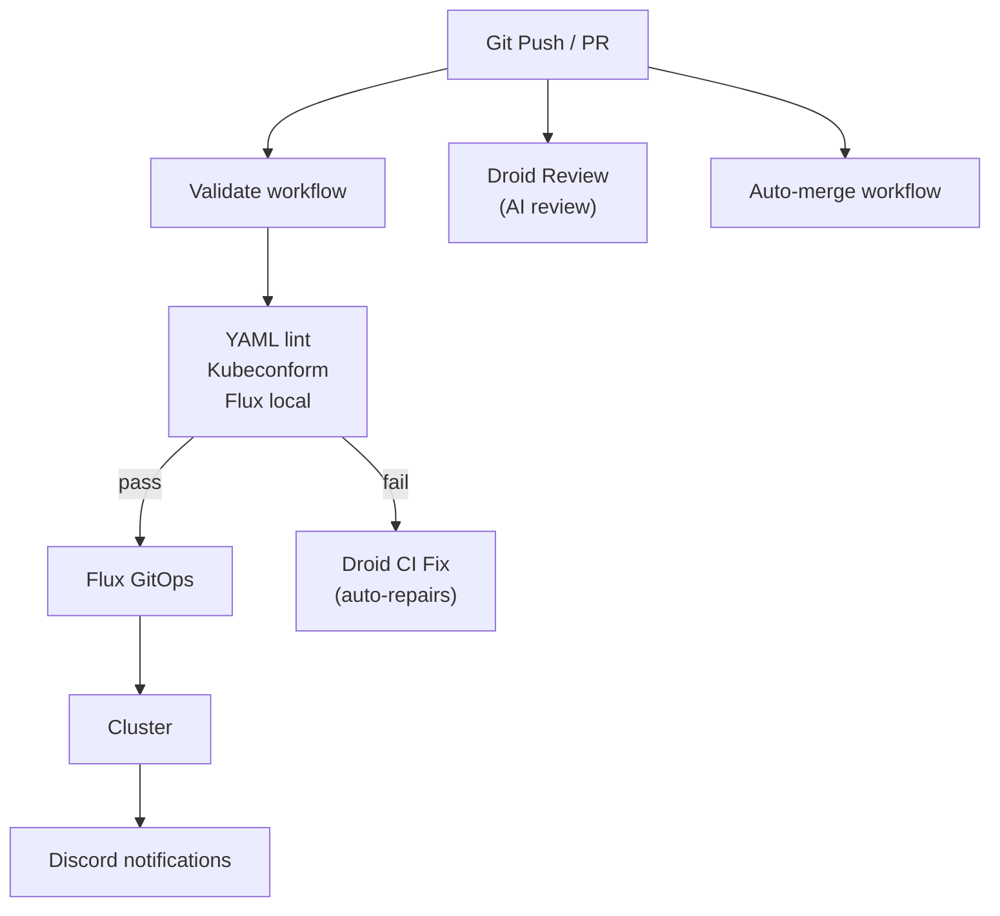

# CI/CD Architecture

This document describes the continuous integration and deployment pipeline for the homelab cluster.

## Overview



## Automation Stack

| Component | Purpose | Trigger |
|-----------|---------|---------|
| **Validate** | YAML/K8s/Flux validation | Push/PR to `main` |
| **Flux Diff** | Comment diffs for Flux resources (non-blocking) | PRs touching `kubernetes/**` |
| **Droid Auto Review** | AI code review | PR opened / ready for review |
| **Droid CI Fix** | Auto-fix validation failures | Validate failure (non-`main` branches) |
| **Renovate** | Dependency + image tag updates | Scheduled scans |
| **Dependabot** | GitHub Actions updates | Weekly |
| **Auto-Merge** | Auto-merge Dependabot PRs | CI passes |
| **Security Scan** | Trivy config scan + gitleaks | Weekly / manual |
| **Release Drafter** | Draft release notes | Push/PR events |
| **Labeler** | Auto-label PRs | PR opened/sync |
| **Discord Notifications** | Push/PR notifications | Push/PR events |
| **Issue Summary** | AI summary comment | Issue opened |

## GitHub Actions Workflows

### Validate (`validate.yaml`)

Runs on every push and PR to ensure code quality.

| Job | Purpose |
|-----|---------|
| **YAML Lint** | Validates YAML syntax and style |
| **Kubeconform** | Validates Kubernetes manifests against schemas |
| **Flux Local** | Tests Flux Kustomizations offline |

```yaml
# Triggered on
on:
  push:
    branches: [main]
  pull_request:
    branches: [main]
```

### Auto-Merge (`auto-merge.yaml`)

Automatically merges Dependabot PRs after CI passes.

| Condition | Action |
|-----------|--------|
| Dependabot PR + minor/patch | Auto-merge with squash |
| GitHub Actions update | Auto-merge immediately |

!!! note
    Renovate is configured to auto-merge most updates directly to `main` without PRs. This workflow is specifically for Dependabot PRs (GitHub Actions updates).

### Flux Diff (`flux-diff.yaml`)

Adds a PR comment showing the `flux-local` diff for `HelmRelease` and `Kustomization` resources.

- Trigger: PRs to `main` that touch `kubernetes/**`
- Behavior: Non-blocking (informational only)

### Release Drafter (`release-drafter.yaml`)

Automatically generates release notes from merged PRs.

- Groups changes by type (features, fixes, dependencies)
- Auto-labels PRs based on file paths
- Maintains a draft release

### Labeler (`labeler.yaml`)

Automatically labels PRs based on changed files.

| Path Pattern | Label |
|--------------|-------|
| `kubernetes/**` | `area/kubernetes` |
| `docs/**` | `area/docs` |
| `.github/**` | `area/ci` |
| `talos/**` | `area/talos` |
| `kubernetes/apps/monitoring/**` | `area/monitoring` |
| `kubernetes/apps/network/**` | `area/network` |

### Droid Code Review (`droid-review.yaml`)

AI-powered code review using Factory's Droid.

- Triggers when a PR is opened or marked ready-for-review
- Reviews Kubernetes/Flux manifests
- Posts inline comments for issues
- Focuses on: YAML errors, security issues, misconfigurations

```yaml
# Requires FACTORY_API_KEY secret
uses: Factory-AI/droid-action@v1
with:
  factory_api_key: ${{ secrets.FACTORY_API_KEY }}
  automatic_review: true
```

### Droid Tag (`droid.yaml`)

Runs Droid when `@droid` is mentioned in an issue/PR/comment.

### Droid CI Fix (`droid-fix.yaml`)

Automatically fixes CI failures on feature branches.

- Triggers when Validate workflow fails
- Analyzes failure logs
- Auto-fixes common issues (syntax, validation)
- Commits and pushes the fix

```
Workflow: Validate fails → Droid analyzes → Fixes code → Pushes commit
```

## Renovate

Configured in `.github/renovate.json5` for automated dependency updates.

### What Renovate Updates

| Category | Examples |
|----------|----------|
| **Helm Charts** | kube-prometheus-stack, cert-manager, cilium |
| **Container Images** | grafana, prometheus, homepage |
| **GitHub Actions** | actions/checkout, actions/upload-artifact |
| **Flux Components** | flux-operator, flux-instance |

### Configuration Highlights

```json5
{
  "extends": ["config:recommended"],
  "flux": { "fileMatch": ["kubernetes/.+\\.ya?ml$"] },
  "helm-values": { "fileMatch": ["kubernetes/.+\\.ya?ml$"] },
  "automerge": true,
  "automergeType": "branch"
}
```

### Auto-merge Rules

- **Patch/minor updates**: Auto-merge directly to `main`
- **Major updates**: PR required (manual review)
- **Security updates**: Prioritized and auto-merged

## Dependabot

Dependabot is used for GitHub Actions updates (see `.github/dependabot.yaml`). These PRs are auto-merged via `auto-merge.yaml`.

## Flux Image Automation

Flux Image Automation resources exist in the repo, but are currently disabled (Renovate handles image updates instead).

If re-enabled, Flux pushes commits to the `flux-image-updates` branch and the `flux-image-pr.yaml` workflow creates a PR to `main`.

## Pre-commit Hooks

Local development hooks configured in `.pre-commit-config.yaml`.

### Installation

```bash
pip install pre-commit
pre-commit install
```

### Hooks

| Hook | Purpose |
|------|---------|
| `trailing-whitespace` | Remove trailing spaces |
| `end-of-file-fixer` | Ensure newline at EOF |
| `check-yaml` | YAML syntax validation |
| `detect-private-key` | Block accidental key commits |
| `yamllint` | YAML style linting |
| `kubeconform` | K8s manifest validation |
| `forbid-secrets` | Ensure SOPS encryption |
| `shellcheck` | Shell script linting |
| `markdownlint` | Markdown formatting |

## Flux GitOps

The cluster uses Flux for GitOps-based deployments.

### Reconciliation Flow

1. **Push to main** → GitHub webhook notifies Flux
2. **Source Controller** → Pulls latest Git revision
3. **Kustomize Controller** → Applies Kustomizations
4. **Helm Controller** → Reconciles HelmReleases

### Webhook Configuration

Flux webhook receiver for instant sync on push:

```
URL: https://flux-webhook.ragas.cc/hook/<token>
Events: push
Content-Type: application/json
```

Get webhook path:
```bash
kubectl -n flux-system get receiver github-webhook -o jsonpath='{.status.webhookPath}'
```

## Security Scanning

### Trivy (via `security.yaml`)

- Scans Kubernetes manifests for misconfigurations
- Runs on a weekly schedule (and manual trigger)
- Reports findings to GitHub Security tab

### Gitleaks

- Scans for accidentally committed secrets
- Blocks PRs with detected credentials

## Notifications

### Discord Integration

Flux sends deployment notifications to Discord.

```yaml
apiVersion: notification.toolkit.fluxcd.io/v1beta3
kind: Provider
metadata:
  name: discord
spec:
  type: discord
  secretRef:
    name: discord-webhook
```

Events sent:
- Kustomization reconciliation (success/failure)
- HelmRelease updates
- Deployment errors

GitHub also sends Discord notifications for pushes to `main` (Kubernetes changes) and PR open/merge events via `discord-notify.yaml`.

## Best Practices

### Commit Messages

Follow conventional commits:
```
<type>(<scope>): <description>

Types: feat, fix, chore, docs, ci, refactor
Scopes: flux, helm, container, github-action
```

Examples:
```
feat(helm): add new monitoring dashboard
fix(container): update grafana to 12.3.0
ci(github-action): bump actions/checkout to v6
```

### Branch Protection

Recommended settings for `main` branch:
- Require PR reviews
- Require status checks (Validate workflow)
- Require linear history

### Testing Changes

Before pushing:
```bash
# Run repo validators
./tests/run_all.sh

# Optional: run pre-commit hooks
pre-commit run --all-files
```
