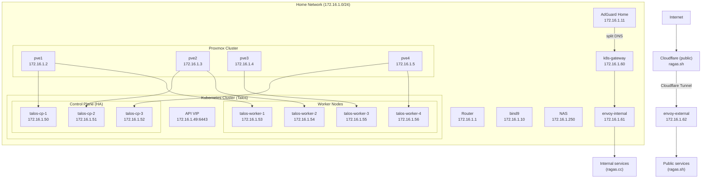

# Cluster Design

## Overview

The Ragas Homelab runs a production-grade Kubernetes cluster using Talos Linux, an immutable, API-managed operating system designed specifically for Kubernetes.

## Why Talos Linux?

| Feature | Talos | Traditional Linux |
|---------|-------|-------------------|
| SSH Access | None (API only) | Full shell access |
| Package Manager | None | apt/yum/etc |
| Configuration | Declarative YAML | Manual/Ansible |
| Updates | Atomic, rollback-able | In-place, risky |
| Attack Surface | Minimal | Large |
| Maintenance | GitOps friendly | Requires access |

## Cluster Architecture



**LoadBalancer IPs (Cilium):**

- `172.16.1.49` Kubernetes API (VIP)
- `172.16.1.60` k8s-gateway (internal DNS)
- `172.16.1.61` envoy-internal (internal ingress)
- `172.16.1.62` envoy-external (external ingress)

## High Availability

### Control Plane HA
- 3 control plane nodes across 3 physical hosts (pve1, pve2, pve4)
- etcd runs on all control plane nodes
- Virtual IP (172.16.1.49) for API server access
- Any control plane node can be lost without cluster impact

### Worker Availability
- Currently 4 worker nodes
- All control plane nodes can also run workloads
- Can scale by adding more workers

## Resource Allocation

VM sizing is managed in Proxmox and may change over time. The stable source-of-truth in this repo is node identity (hostname/IP) and cluster topology.

## Talos Configuration

!!! note
    This cluster was bootstrapped manually (not with talhelper). The `talos/` folder is primarily documentation plus reusable patch snippets.

### Talos config files in this repo

```
talos/
├── talenv.yaml             # Version pinning
├── talconfig.yaml          # Documentation-only example (not applied directly)
└── patches/
    ├── controller/         # Control plane patches
    └── global/             # All-node patches
```

### Adding nodes (high level)

Copy the machine config from an existing node, edit hostname/IP/MAC, and apply to the new node in maintenance mode:

```bash
talosctl -n <existing-node-ip> get machineconfig -o jsonpath='{.spec}' > /tmp/new-node.yaml
# edit /tmp/new-node.yaml
talosctl apply-config --insecure --nodes <new-node-ip> --file /tmp/new-node.yaml
```

### Key Talos Features Used
- **Cilium CNI**: eBPF-based networking
- **KubePrism**: Local API server load balancing
- **Disk encryption**: TPM-based (optional)
- **Secure boot**: UEFI with measured boot

## Deployment Model

All changes follow GitOps principles:

```
Developer → Git Push → GitHub → Flux Reconciliation → Kubernetes
                                        ↓
                              HelmRelease/Kustomization
                                        ↓
                                   Deployed Pods
```

## Disaster Recovery

### Backup Strategy
- etcd snapshots via Talos API
- Velero for application backups
- Git repository is source of truth

### Recovery Procedures
1. **Single node failure**: Automatic recovery
2. **Quorum loss**: Restore from etcd snapshot
3. **Full cluster loss**: Rebuild from Git + backups

## Security Model

- No SSH access to nodes
- All management via Talos API (mTLS)
- RBAC for Kubernetes access
- Network policies via Cilium
- Secrets encrypted with SOPS/Age
