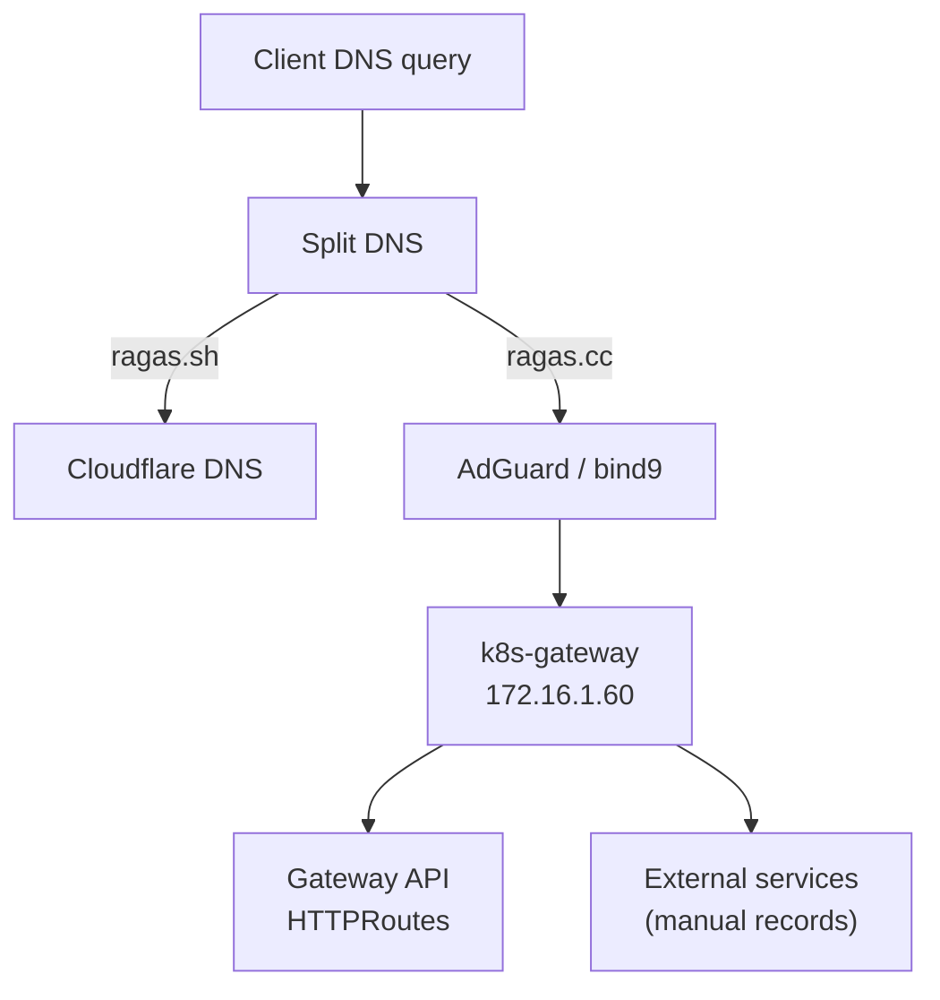

# Network Architecture

## Overview

The cluster uses Cilium as the CNI with Gateway API for ingress, providing modern, eBPF-based networking with advanced load balancing capabilities.

## Network Segments

| Network | CIDR | Purpose |
|---------|------|---------|
| Node Network | 172.16.1.0/24 | Physical/VM network |
| Pod Network | 10.42.0.0/16 | Kubernetes pods |
| Service Network | 10.43.0.0/16 | Kubernetes services |

## IP Allocations

### Infrastructure IPs
| IP | Service | Description |
|----|---------|-------------|
| 172.16.1.1 | Router | Default gateway |
| 172.16.1.2-5 | Proxmox | pve1-pve4 |
| 172.16.1.10 | bind9 | Internal DNS (authoritative for `ragas.cc`) |
| 172.16.1.11 | AdGuard Home | Primary DNS |

### Kubernetes IPs
| IP | Service | Description |
|----|---------|-------------|
| 172.16.1.49 | Kubernetes VIP | API server (HA) |
| 172.16.1.50-52 | Control Plane | talos-cp-1/2/3 |
| 172.16.1.53-56 | Workers | talos-worker-1..4 |
| 172.16.1.60 | k8s-gateway | Internal DNS resolution |
| 172.16.1.61 | envoy-internal | Internal ingress gateway |
| 172.16.1.62 | envoy-external | External ingress gateway |

## Cilium Configuration

### Features Enabled
- **eBPF**: Kernel-level packet processing
- **DSR (Direct Server Return)**: Optimal load balancing
- **Gateway API**: Modern ingress control
- **L2 Announcements**: ARP for LoadBalancer IPs

### Load Balancer Mode
```yaml
loadBalancer:
  mode: dsr
  acceleration: native
l2announcements:
  enabled: true
```

## Gateway API

### Gateways

**Internal Gateway** (`envoy-internal`)
- IP: 172.16.1.61
- Purpose: Internal services accessible on home network
- TLS: Wildcard cert for *.ragas.cc

**External Gateway** (`envoy-external`)
- IP: 172.16.1.62
- Purpose: Public services via Cloudflare tunnel
- TLS: Let's Encrypt (via cert-manager + Cloudflare DNS-01)

### HTTPRoute Example
```yaml
apiVersion: gateway.networking.k8s.io/v1
kind: HTTPRoute
metadata:
  name: my-app
  namespace: default
spec:
  parentRefs:
    - name: envoy-internal
      namespace: network
  hostnames:
    - "myapp.ragas.cc"
  rules:
    - matches:
        - path:
            type: PathPrefix
            value: /
      backendRefs:
        - name: my-app
          port: 80
```

## DNS Architecture

### Split DNS Setup



### DNS Resolution Flow
1. Client queries AdGuard (172.16.1.11)
2. AdGuard forwards `ragas.cc` queries to k8s-gateway (172.16.1.60)
3. k8s-gateway returns the appropriate gateway IP based on `HTTPRoute`s
4. Client connects to envoy-internal (172.16.1.61)
5. Envoy routes to backend pod

### AdGuard Configuration
Forward `ragas.cc` queries to `k8s-gateway` (172.16.1.60) so DNS answers are driven by `HTTPRoute` and `Service` resources:

```
[/ragas.cc/]172.16.1.60
```

## Network Policies

Cilium network policies control pod-to-pod traffic:

```yaml
apiVersion: cilium.io/v2
kind: CiliumNetworkPolicy
metadata:
  name: allow-web
spec:
  endpointSelector:
    matchLabels:
      app: web
  ingress:
    - fromEndpoints:
        - matchLabels:
            app: frontend
      toPorts:
        - ports:
            - port: "80"
              protocol: TCP
```

## TLS Certificates

### cert-manager Flow
```
1. HTTPRoute created with hostname
2. cert-manager detects via Gateway annotation
3. ACME challenge via Cloudflare DNS-01
4. Certificate issued and stored as Secret
5. Envoy Gateway uses certificate for TLS
```

### Certificate Resources
```yaml
# Wildcard certificate for all services
apiVersion: cert-manager.io/v1
kind: Certificate
metadata:
  name: wildcard-ragas-cc
  namespace: network
spec:
  secretName: wildcard-ragas-cc-tls
  issuerRef:
    name: letsencrypt-production
    kind: ClusterIssuer
  dnsNames:
    - "*.ragas.cc"
    - "ragas.cc"
```

## Troubleshooting

### Check Cilium Status
```bash
cilium status
cilium connectivity test
```

### Check Gateway Status
```bash
kubectl get gateways -A
kubectl get httproutes -A
kubectl describe gateway envoy-internal -n network
```

### Check DNS Resolution
```bash
# From inside cluster
kubectl run -it --rm debug --image=alpine -- nslookup myapp.ragas.cc

# From local network
dig @172.16.1.60 myapp.ragas.cc
```

### Check Certificates
```bash
kubectl get certificates -A
kubectl describe certificate wildcard-ragas-cc -n network
```
