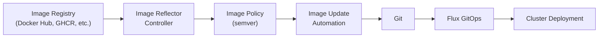

# Flux Image Automation

This guide explains Flux Image Automation and how it is used in this repo.

## Status in this repo

Flux Image Automation is **enabled** and works alongside Renovate:

- **Flux Image Automation**: Scans registries, detects latest tags, can auto-commit updates
- **Renovate**: Creates PRs for version updates, auto-merges minor/patch

The manifests live under `kubernetes/apps/flux-system/image-automation/`.

### Currently Tracked Images

| App | Registry | Policy |
|-----|----------|--------|
| sonarr | ghcr.io/linuxserver/sonarr | semver >=4.0.0 |
| radarr | ghcr.io/linuxserver/radarr | semver >=5.0.0 |
| prowlarr | ghcr.io/linuxserver/prowlarr | semver >=1.0.0 |
| overseerr | ghcr.io/linuxserver/overseerr | semver >=1.0.0 (version-vX.X.X format) |
| huntarr | docker.io/huntarr/huntarr | semver >=0.1.0 |
| agregarr | docker.io/agregarr/agregarr | semver >=0.1.0 |
| unpackerr | ghcr.io/hotio/unpackerr | semver >=0.1.0 (release-X.X.X format) |
| speedtest-tracker | ghcr.io/linuxserver/speedtest-tracker | semver >=0.1.0 |
| apprise | ghcr.io/linuxserver/apprise-api | semver >=0.1.0 |
| homepage | ghcr.io/gethomepage/homepage | semver >=0.9.0 |
| grafana | grafana/grafana | semver >=11.0.0 |
| mkdocs-material | squidfunk/mkdocs-material | semver 9.x |

## How it works (when enabled)

Flux Image Automation:

1. **Scans** container registries for new tags
2. **Evaluates** tags against version policies
3. **Updates** image references in Git
4. **Commits** and pushes changes
5. **Deploys** via normal GitOps flow



## Components

### Image Reflector Controller

Scans container registries and stores available tags.

```bash
# Check controller status
kubectl get deployment -n flux-system image-reflector-controller
```

### Image Automation Controller

Commits image updates back to Git.

```bash
# Check controller status
kubectl get deployment -n flux-system image-automation-controller
```

## Repo configuration (when enabled)

### ImageRepository

Defines which container registry to scan.

See: `kubernetes/apps/flux-system/image-automation/app/image-repositories.yaml`

### ImagePolicy

Defines version selection rules.

```yaml
apiVersion: image.toolkit.fluxcd.io/v1
kind: ImagePolicy
metadata:
  name: homepage
spec:
  imageRepositoryRef:
    name: homepage
  policy:
    semver:
      range: ">=0.9.0"  # Any version >= 0.9.0
```

**Policy types:**

| Type | Example | Use Case |
|------|---------|----------|
| `semver.range` | `>=1.0.0` | Follow semantic versioning |
| `semver.range` | `1.x` | Stay on major version 1 |
| `numerical` | `asc` or `desc` | Numeric tags |
| `alphabetical` | `asc` or `desc` | Alphabetic tags |

See: `kubernetes/apps/flux-system/image-automation/app/image-policies.yaml`

### ImageUpdateAutomation

Configures how updates are committed.

```yaml
apiVersion: image.toolkit.fluxcd.io/v1
kind: ImageUpdateAutomation
metadata:
  name: flux-system
spec:
  git:
    push:
      branch: flux-image-updates
```

See: `kubernetes/apps/flux-system/image-automation/app/image-update-automation.yaml`

Check status:
```bash
kubectl get imageupdateautomation -n flux-system
kubectl describe imageupdateautomation flux-system -n flux-system
```

## Enabling it (optional)

1. Uncomment the image automation kustomization:
   ```yaml
   # kubernetes/apps/flux-system/kustomization.yaml
   - ./image-automation/ks.yaml
   ```
2. Commit and push.
3. Confirm resources exist:
   ```bash
   kubectl get imagerepositories,imagepolicies,imageupdateautomations -n flux-system
   ```

## Adding a New Image

### Step 1: Create ImageRepository

```yaml
# kubernetes/apps/flux-system/image-automation/app/image-repositories.yaml
---
apiVersion: image.toolkit.fluxcd.io/v1
kind: ImageRepository
metadata:
  name: my-app
spec:
  image: docker.io/myorg/my-app
  interval: 6h
```

### Step 2: Create ImagePolicy

```yaml
# kubernetes/apps/flux-system/image-automation/app/image-policies.yaml
---
apiVersion: image.toolkit.fluxcd.io/v1
kind: ImagePolicy
metadata:
  name: my-app
spec:
  imageRepositoryRef:
    name: my-app
  policy:
    semver:
      range: ">=1.0.0"
```

### Step 3: Add Image Marker

Add a comment marker to your deployment:

```yaml
# In your deployment.yaml
containers:
  - name: my-app
    image: docker.io/myorg/my-app:1.0.0 # {"$imagepolicy": "flux-system:my-app"}
```

The marker format is:
```
# {"$imagepolicy": "<namespace>:<policy-name>"}
```

### Step 4: Commit and Push

```bash
git add -A
git commit -m "feat: add image automation for my-app"
git push
```

## Troubleshooting

### Image not updating

1. **Check ImageRepository status:**
   ```bash
   kubectl describe imagerepository <name> -n flux-system
   ```
   Look for scan errors or authentication issues.

2. **Check ImagePolicy status:**
   ```bash
   kubectl describe imagepolicy <name> -n flux-system
   ```
   Verify the policy matches available tags.

3. **Check ImageUpdateAutomation:**
   ```bash
   kubectl describe imageupdateautomation flux-system -n flux-system
   ```
   Look for Git push errors.

### Private registry authentication

For private registries, create a secret:

```bash
kubectl create secret docker-registry regcred \
  --namespace flux-system \
  --docker-server=ghcr.io \
  --docker-username=<username> \
  --docker-password=<token>
```

Reference in ImageRepository:
```yaml
spec:
  secretRef:
    name: regcred
```

### Force immediate scan

```bash
flux reconcile image repository <name>
```

### View all image updates

```bash
# See what images would be updated
kubectl get imagepolicy -n flux-system -o wide

# See last update time
kubectl get imageupdateautomation -n flux-system
```

## Best Practices

### 1. Use Semver Ranges

Prefer semantic versioning to avoid breaking changes:
```yaml
# Good - stay on major version
range: "1.x"

# Good - minimum version
range: ">=1.0.0 <2.0.0"

# Risky - any version
range: "*"
```

### 2. Exclude Pre-release Tags

```yaml
spec:
  exclusionList:
    - "^.*-alpha.*$"
    - "^.*-beta.*$"
    - "^.*-rc.*$"
    - "^.*-dev$"
```

### 3. Set Appropriate Scan Intervals

| Image Type | Recommended Interval |
|------------|---------------------|
| Critical (CNI, DNS) | 12h-24h |
| Applications | 6h |
| Development | 1h |

### 4. Monitor Automated Commits

Watch for image update commits:
```bash
git log --oneline --author="flux-image-automation"
```

## Files Reference

```
kubernetes/apps/flux-system/image-automation/
├── app/
│   ├── image-repositories.yaml  # Registry definitions
│   ├── image-policies.yaml      # Version policies
│   ├── image-update-automation.yaml  # Git commit config
│   └── kustomization.yaml
└── ks.yaml  # Flux Kustomization
```
